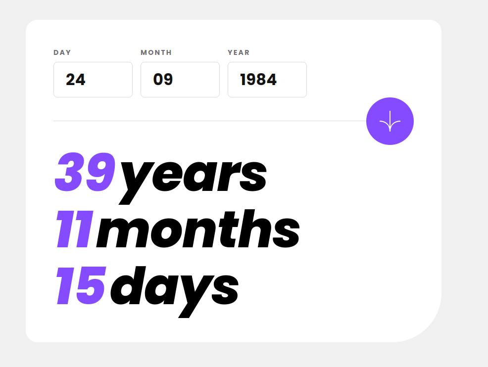
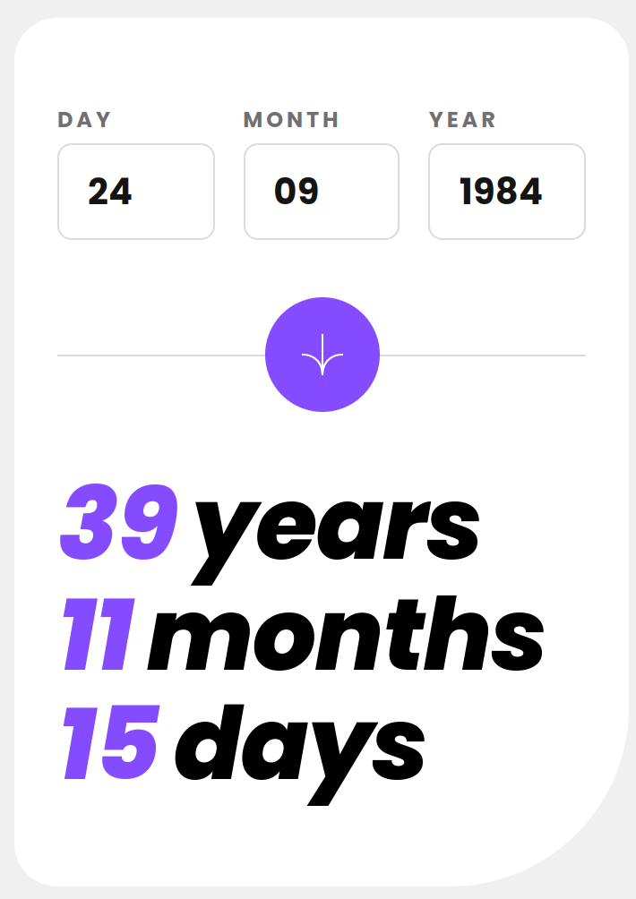

# Frontend Mentor - Age calculator app solution

This is a solution to the [Age calculator app challenge on Frontend Mentor](https://www.frontendmentor.io/challenges/age-calculator-app-dF9DFFpj-Q). Frontend Mentor challenges help you improve your coding skills by building realistic projects. 

## Table of contents

- [Overview](#overview)
  - [The challenge](#the-challenge)
  - [Screenshot](#screenshot)
  - [Links](#links)
- [My process](#my-process)
  - [Built with](#built-with)
  - [What I learned](#what-i-learned)
  - [Continued development](#continued-development)
  - [Useful resources](#useful-resources)
- [Author](#author)

## Overview

### The challenge

Users should be able to:

- View an age in years, months, and days after submitting a valid date through the form
- Receive validation errors if:
  - Any field is empty when the form is submitted
  - The day number is not between 1-31
  - The month number is not between 1-12
  - The year is in the future
  - The date is invalid e.g. 31/04/1991 (there are 30 days in April)
- View the optimal layout for the interface depending on their device's screen size
- See hover and focus states for all interactive elements on the page
- **Bonus**: See the age numbers animate to their final number when the form is submitted

### Screenshot

#### Desktop

####  Mobile

### Links

- [Solution URL](https://github.com/vstm/fe-mentor/tree/main/age-calculator-app-main)
- [Live Site URL](https://vstm.github.io/fe-mentor/age-calculator-app-main/)

## My process

### Built with

- [VueJS](https://vuejs.org/)
- [Sass](https://sass-lang.com/)
- [Vitest](https://vitest.dev/)
- [VueUse (just for the animation)](https://vueuse.org/)
- [Semantic HTML5 markup](https://developer.mozilla.org/en-US/docs/Web/HTML)
- [Flexbox](https://developer.mozilla.org/en-US/docs/Web/CSS/CSS_flexible_box_layout)
- [CSS Grid](https://developer.mozilla.org/en-US/docs/Web/CSS/CSS_grid_layout)
- [VSCode](https://code.visualstudio.com/)
- [Prettier](https://prettier.io/)

### What I learned

- The JS date functions do not provide a simple way to calculate the difference in years/months/days so I had to write a function for that and I used Vitest to verify that it returns the expected value
- 

### Continued development

- The day validation could be improved if we know the year & month (or just the month)

### Useful resources

- [Vitext/test.each](https://vitest.dev/api/#test-each) - I never used "data providers" in Jest/Vitest tests, so I was glad that something similar exists
- [VueJS/composables](https://vuejs.org/guide/reusability/composables) - Nice refresher on composables. I used it to refactor the AgeCalculator component to make it a bit nicer.

## Author

- Website - [Stefan Vetsch](https://svetsch.ch/)
- Frontend Mentor - [@vstm](https://www.frontendmentor.io/profile/vstm)
