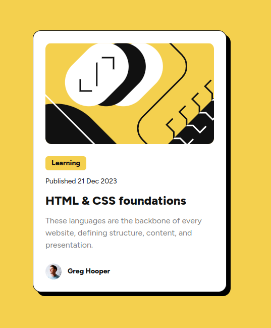

# Frontend Mentor - Blog preview card solution

This is a solution to the [Blog preview card challenge on Frontend Mentor](https://www.frontendmentor.io/challenges/blog-preview-card-ckPaj01IcS). Frontend Mentor challenges help you improve your coding skills by building realistic projects. 

## Table of contents

- [Overview](#overview)
  - [The challenge](#the-challenge)
  - [Screenshot](#screenshot)
  - [Links](#links)
- [My process](#my-process)
  - [Built with](#built-with)
  - [What I learned](#what-i-learned)
- [Author](#author)

## Overview

### The challenge

Users should be able to:

- See hover and focus states for all interactive elements on the page

### Screenshot

### Links

- [Solution URL](https://github.com/vstm/fe-mentor/tree/main/blog-preview-card-main)
- [Add live site URL here](https://vstm.github.io/fe-mentor/blog-preview-card-main/)

## My process

### Built with

- [Semantic HTML5 markup](https://developer.mozilla.org/en-US/docs/Web/HTML)
- [tailwindcss](https://tailwindcss.com/)
- [Flexbox](https://developer.mozilla.org/en-US/docs/Web/CSS/CSS_flexible_box_layout)
- [VSCode](https://code.visualstudio.com/)
- [@font-face](https://developer.mozilla.org/en-US/docs/Web/CSS/@font-face)
- [Prettier](https://prettier.io/)

### What I learned

I actually never used the `@font-face` css rule, so using this was new to me. Only afterwards I noticed the link to the Google Font page in the style-guide.md so I could have used the handy google embed code :D.

I wasn't sure how the hover should work it seemed to me that the whole card would have a hover state (which the shadow), or if there are two hover states (one for the card and one for the title/heading).

## Author

- Website - [Stefan Vetsch](https://svetsch.ch/)
- Frontend Mentor - [@vstm](https://www.frontendmentor.io/profile/vstm)
