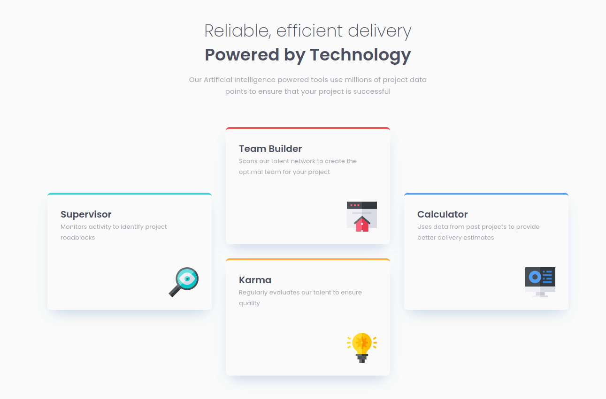

# Frontend Mentor - Four card feature section solution

This is a solution to the [Four card feature section challenge on Frontend Mentor](https://www.frontendmentor.io/challenges/four-card-feature-section-weK1eFYK). Frontend Mentor challenges help you improve your coding skills by building realistic projects. 

## Table of contents

- [Overview](#overview)
  - [The challenge](#the-challenge)
  - [Screenshot](#screenshot)
  - [Links](#links)
- [My process](#my-process)
  - [Built with](#built-with)
  - [What I learned](#what-i-learned)
  - [Continued development](#continued-development)
  - [Useful resources](#useful-resources)
- [Author](#author)

## Overview

### The challenge

Users should be able to:

- View the optimal layout for the site depending on their device's screen size

### Screenshot

#### Desktop

#### Mobile

### Links

- [Solution URL](https://github.com/vstm/fe-mentor/tree/main/four-card-feature-section-master)
- [Live Site URL](https://vstm.github.io/fe-mentor/four-card-feature-section-master/)

## My process

### Built with

- [Semantic HTML5 markup](https://developer.mozilla.org/en-US/docs/Web/HTML)
- [tailwindcss](https://tailwindcss.com/)
- [Flexbox](https://developer.mozilla.org/en-US/docs/Web/CSS/CSS_flexible_box_layout)
- [CSS Grid](https://developer.mozilla.org/en-US/docs/Web/CSS/CSS_grid_layout)
- [VSCode](https://code.visualstudio.com/)
- [Prettier](https://prettier.io/)

### What I learned

I learned how to use CSS grid with flexbox a bit better. I'm not sure if I did it correctly/as intended on the desktop layout, but it looks like the design so I guess it's ok.

Also the Figma/Design for this challenge was a bit weird in terms of the sizes. The header size was fixed to a size which would be too small to contain the title and subtitle which was funny. I adapted here by decreasing the gap between the title/subtitle and the intro text element accordingly.

I tried to "challenge" myself a bit by only using rem units instead of pixels. The only exceptions were for the title/intro text gap and the box-shadow definition.

### Continued development

Well because the design sometimes uses spacings that do not align well with rem's the resulting rems are a somewhat complicated. Here it could be improved by using rounded numbers or maybe even better use values from tailwinds spacing/size system. This would lead to small deviations from the design but would make the code more readable.

### Useful resources

- [Tailwindcss grid docs](https://tailwindcss.com/docs/grid-template-columns) - This helped me with the grid layout

## Author

- Website - [Stefan Vetsch](https://svetsch.ch/)
- Frontend Mentor - [@vstm](https://www.frontendmentor.io/profile/vstm)

