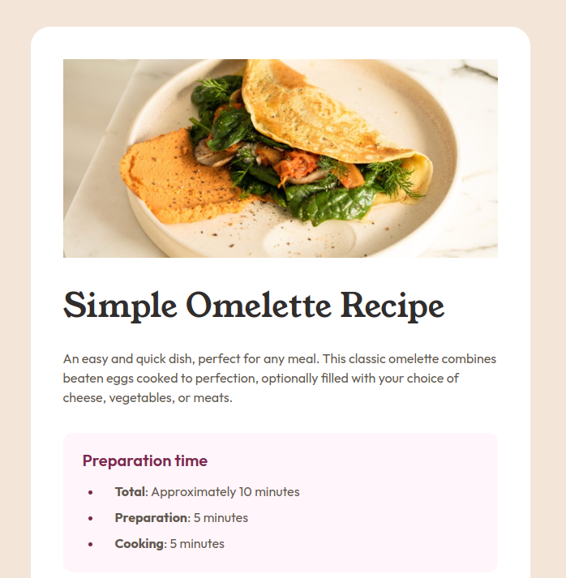

# Frontend Mentor - Recipe page solution

This is a solution to the [Recipe page challenge on Frontend Mentor](https://www.frontendmentor.io/challenges/recipe-page-KiTsR8QQKm). Frontend Mentor challenges help you improve your coding skills by building realistic projects. 

## Table of contents

- [Overview](#overview)
  - [The challenge](#the-challenge)
  - [Screenshot](#screenshot)
  - [Links](#links)
- [My process](#my-process)
  - [Built with](#built-with)
  - [What I learned](#what-i-learned)
  - [Continued development](#continued-development)
  - [Useful resources](#useful-resources)
- [Author](#author)

**Note: Delete this note and update the table of contents based on what sections you keep.**

## Overview

### Screenshot

### Links

- Solution URL: [https://github.com/vstm/fe-mentor/tree/main/recipe-page-main](https://github.com/vstm/fe-mentor/tree/main/recipe-page-main)
- Live Site URL: [https://vstm.github.io/fe-mentor/recipe-page-main/](https://vstm.github.io/fe-mentor/recipe-page-main/)

## My process

### Built with

- [Semantic HTML5 markup](https://developer.mozilla.org/en-US/docs/Web/HTML)
- [tailwindcss](https://tailwindcss.com/)
- [Flexbox](https://developer.mozilla.org/en-US/docs/Web/CSS/CSS_flexible_box_layout)
- [VSCode](https://code.visualstudio.com/)
- [Prettier](https://prettier.io/)
- Mobile-first workflow
- Pain

### What I learned

Well this was the first challenge where it was necessary to style tables and ordered/unordered lists, which I have never done with tailwindcss so it was quite interessing. 

For the table I did not want to style each cell individually. This is what you are supposed to to with tailwind, and it would be no problem if I would implement it with web-components (or something like that) but I wanted to keep it HTML only so I wrote a small plugin for implementing custom variants which allowed me to style the individual rows on the `<table>` element itself. I could've just used CSS for that but I wanted to do it in a tailwindish kind of way.

The lists where a different story. In the design there were particular spacings before and after the bullet/disc symbol. I of course tried to replicate it but it turned out to be somewhat tricky (or maybe I just don't know the magic CSS properties to do that). I tried to playing around with `list-style-position`, it seems that `inside` clears the indentation of the "hanging" text, so one would need to replicate that behaviour. With `list-style-position: outside` you have to apply a left padding to bring in the disc/bullet point. I just applied a padding which visually matched the design.

So I hope I never have to style lists like that again :D, or maybe I stumble on the right way (TM) to style it.

Also I noticed that in the table the line is 0.5px smaller (23.5px) than in the design (24px), altough I used the exact font settings (and outside of the table it matches). I half-heartedly tried to find out why, but I didn't find an answer.

### Continued development

- I'm still not sure how to debug differences in the font rendering
- Styling list items: I shall find out more about that
- Styling tables with tailwindcss: Are we all doomed?

### Useful resources

- https://developer.mozilla.org/en-US/docs/Web/CSS/list-style - For this challenge I needed to freshen up my knowledge on list styling, the MDN page was very helpful
- https://developer.mozilla.org/en-US/docs/Web/CSS/::marker - Same for the marker pseudo element which needed some styling
- https://tailwindcss.com/docs/hover-focus-and-other-states#list-markers - The section of tailwindcss for styling the list markers
- https://tailwindcss.com/docs/plugins#adding-variants - Tailwind plugins for adding new "variants"

## Author

- Website - [Stefan Vetsch](https://svetsch.ch/)
- Frontend Mentor - [@vstm](https://www.frontendmentor.io/profile/vstm)
