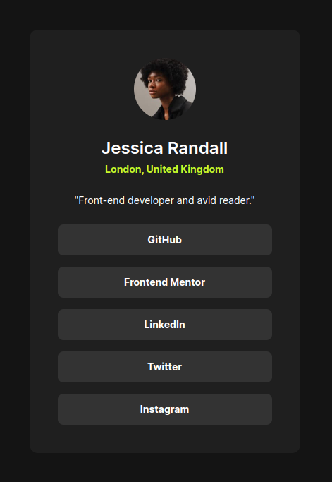

# Frontend Mentor - Social links profile solution

This is a solution to the [Social links profile challenge on Frontend Mentor](https://www.frontendmentor.io/challenges/social-links-profile-UG32l9m6dQ). Frontend Mentor challenges help you improve your coding skills by building realistic projects. 

## Table of contents

- [Overview](#overview)
  - [The challenge](#the-challenge)
  - [Screenshot](#screenshot)
  - [Links](#links)
- [My process](#my-process)
  - [Built with](#built-with)
  - [What I learned](#what-i-learned)
- [Author](#author)

## Overview

### The challenge

Users should be able to:

- See hover and focus states for all interactive elements on the page

### Screenshot

### Links

- [Solution URL](https://github.com/vstm/fe-mentor/tree/main/social-links-profile-main)
- [Live Site URL](https://vstm.github.io/fe-mentor/social-links-profile-main/)

## My process

### Built with

- [Semantic HTML5 markup](https://developer.mozilla.org/en-US/docs/Web/HTML)
- [tailwindcss](https://tailwindcss.com/)
- [Flexbox](https://developer.mozilla.org/en-US/docs/Web/CSS/CSS_flexible_box_layout)
- [VSCode](https://code.visualstudio.com/)
- [Prettier](https://prettier.io/)

### What I learned

This is my third "newbie" challenge so I didn't learn that much here, it was basically consolidating the learnings from previous challenges, I got the hang of things so I could focus a bit better on just getting the measurements right.

I became aware of the "Layout" section in the [style-guide](./style-guide.md) and how it might affect the breakpoints I used, so I added a `screen` breakpoint to the `tailwind.config.js`. I did not add the mobile breakpoint since this is the default breakpoint (mobile first).

## Author

- Website - [Stefan Vetsch](https://svetsch.ch/)
- Frontend Mentor - [@vstm](https://www.frontendmentor.io/profile/vstm)

