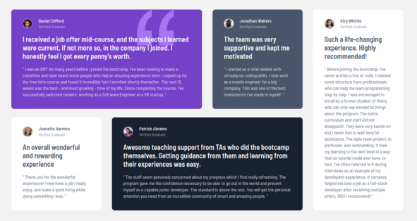

# Frontend Mentor - Testimonials grid section solution

This is a solution to the [Testimonials grid section challenge on Frontend Mentor](https://www.frontendmentor.io/challenges/testimonials-grid-section-Nnw6J7Un7). Frontend Mentor challenges help you improve your coding skills by building realistic projects. 

## Table of contents

- [Overview](#overview)
  - [The challenge](#the-challenge)
  - [Screenshot](#screenshot)
  - [Links](#links)
- [My process](#my-process)
  - [Built with](#built-with)
  - [What I learned](#what-i-learned)
  - [Continued development](#continued-development)
  - [Useful resources](#useful-resources)
- [Author](#author)

## Overview

### The challenge

Users should be able to:

- View the optimal layout for the site depending on their device's screen size

### Screenshot

#### Desktop

#### Mobile

### Links

- [Solution URL](https://github.com/vstm/fe-mentor/tree/main/testimonials-grid-section-main)
- [Live Site URL](https://vstm.github.io/fe-mentor/testimonials-grid-section-main/)

## My process

### Built with

- [Semantic HTML5 markup](https://developer.mozilla.org/en-US/docs/Web/HTML)
- [tailwindcss](https://tailwindcss.com/)
- [Flexbox](https://developer.mozilla.org/en-US/docs/Web/CSS/CSS_flexible_box_layout)
- [CSS Grid](https://developer.mozilla.org/en-US/docs/Web/CSS/CSS_grid_layout)
- [VSCode](https://code.visualstudio.com/)
- [Prettier](https://prettier.io/)

### What I learned

This is not a "new" learning but I noticed how hard it is in tailwind to "see" what the different variants of a components are. 

### Continued development

Nothing in particular comes to mind for further development.

### Useful resources

- [Tailwindcss grid docs](https://tailwindcss.com/docs/grid-template-columns) - This helped me with the grid layout

## Author

- Website - [Stefan Vetsch](https://svetsch.ch/)
- Frontend Mentor - [@vstm](https://www.frontendmentor.io/profile/vstm)

